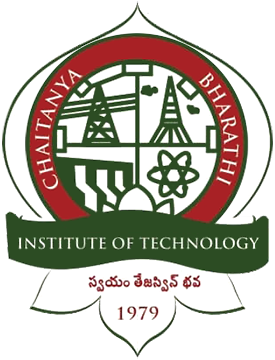

# CBIT Activity Point System (Autonomous)

<div align="center">
  
  
  # **Chaitanya Bharathi Institute of Technology (Autonomous)**
  ### *Affiliated to Osmania University • NAAC A++ • NBA Accredited • Hyderabad-75*

  ## 🏆 **CBIT Activity Point System & AI Verification Platform**

  [](https://cbit-activity-points.vercel.app)
  [](https://github.com/saleemshaik2005/CBIT-Activity-Points)
  [](https://aistudio.google.com)
  [](https://nextjs.org)
</div>

---

### 🌐 **Live Website Link**
👉 **[https://cbit-activity-points.vercel.app](https://cbit-activity-points.vercel.app)** *(Click to launch the live application)*

---

## 📖 Project Overview

A state-of-the-art web application engineered for **Chaitanya Bharathi Institute of Technology (Autonomous), Hyderabad** to automate non-academic Activity Points management (60 points target for 4-year B.E./B.Tech, 50 points for Diploma Lateral Entry) across Semesters I through VIII.

The platform integrates **Google Gemini Multimodal AI** for real-time document OCR, certificate title & issuer parsing, QR verification links, and automatic mapping to the **24 Approved Activity Categories** with point caps and mentor verification workflows.

---

## 👨‍💻 Project Development & Academic Attribution

* **Developed By:** Team of 4 Students of Department of Artificial Intelligence & Data Science (AI&DS), Section 2, 5th Semester, Batch of 2026.
* **Project Guide & Mentor:** **Dr. D. Ramana Sir**, Department of Artificial Intelligence and Data Science (AI&DS), CBIT Hyderabad.
* **Head of Department (HoD):** **Dr. K. Radhika Madam**, Head of Department (AI&DS), CBIT Autonomous Hyderabad.

---

## 🌟 Key Features

1. **Google Gemini Multimodal AI Document Intelligence**:
   * Direct certificate upload in JPG, PNG, HEIC, or PDF format.
   * Instant camera capture support from mobile smartphones.
   * Auto-extracts:
     * Activity / Certification Title
     * Recipient Student Name
     * Issuing Organization / Authority
     * Completion / Award Date (`YYYY-MM-DD`)
     * **Credential ID / Certificate Number**
     * **QR Verification URL link**
     * Suggested Activity Points according to CBIT rubrics
   * **100% Student Editability**: Students can review and refine all fields before submitting.

2. **5 Distinct Academic Portals**:
   * **Student Portal**: Real-time progress bar toward 60/50 points, category breakdown, submission logs, and official printable 24-row PDF generator.
   * **Faculty Mentor Portal**: Side-by-side certificate previewer, document inspection lightbox, 1-click Approve, Reject with student remarks, and point adjustment.
   * **Class Coordinator Portal**: Section analytics, at-risk student monitoring (<30 points), and batch reports.
   * **Head of Department (HoD) Portal**: Branch completion statistics and final digital graduation signoff.
   * **Administrator Portal**: Dynamic 24 category rulebook editor, custom point caps, and mentor allocation.

3. **Official Printable Activity Sheet (jsPDF)**:
   * 1-Click download of the exact physical 24-row **Record of Activities for Activity Points** sheet with semester I–VIII breakdown and Mentor/HoD signature blocks.

---

## 📋 The 24 Approved CBIT MAR Activity Categories

1. **MOOCs** (SWAYAM / NPTEL / Coursera / equivalent - 8 & 12 weeks)
2. **Tech Fest / R&D Day / Freshers Workshop / Conference / Hackathons** (Organizer / Participant)
3. **Rural Reporting**
4. **Harithaharam / Plantation Drives**
5. **Participation in Relief Camps**
6. **Participation in Debate / Group Discussion / Technical Quiz**
7. **Publication in Newspaper / Institution Magazine** (Editor / Writer)
8. **Publication in External Newspaper, Magazine & Blogs**
9. **Research Publication** (Scopus / UGC CARE / IEEE indexed)
10. **Innovation Projects** (Prototypes, Patents, Startups outside curriculum)
11. **Blood Donation / NSS or NCC Participation**
12. **Blood Donation / NSS Camp Organization**
13. **Participation in Sports & Games** (College, University, Regional, State, National level)
14. **Cultural Programmes** (Dance, Drama, Music, Fest performance)
15. **Member of Professional Societies** (IEEE, CSI, ACM, IETE, ASME, SAE)
16. **Student Chapters / Campus Clubs**
17. **Relevant Industry Visit & Report**
18. **Photography Activities in Clubs**
19. **Participation in Yoga Camp**
20. **Self-Entrepreneurship Program**
21. **Adventure Sports with Certification**
22. **Training to Underprivileged / Differently-Abled**
23. **Community Service & Allied Activities**
24. **Class Representative (CR)**

---

## 🛠️ Tech Stack

* **Framework**: [Next.js 16 (App Router)](https://nextjs.org) + [React 19](https://react.dev)
* **Styling**: [Tailwind CSS](https://tailwindcss.com) (Official CBIT Forest Green `#385529` & Gold `#a16b15`)
* **AI Engine**: Google Gemini Multimodal API (`@google/genai` / `gemini-3.6-flash`)
* **Database & Auth**: [Supabase](https://supabase.com) (PostgreSQL with Row Level Security)
* **PDF Engine**: [jsPDF](https://github.com/parallax/jsPDF) & `jspdf-autotable`
* **Icons**: [Lucide React](https://lucide.dev)

---

## 🚀 Quick Local Setup Guide

### 1. Clone the repository
```bash
git clone https://github.com/saleemshaik2005/CBIT-Activity-Points.git
cd CBIT-Activity-Points
```

### 2. Install dependencies
```bash
npm install
```

### 3. Configure environment variables
Create a `.env.local` file in the root directory:
```env
NEXT_PUBLIC_SUPABASE_URL=https://your-project.supabase.co
NEXT_PUBLIC_SUPABASE_ANON_KEY=your-supabase-anon-key
GEMINI_API_KEY=AIzaSy...
```

### 4. Run Development Server
```bash
npm run dev
```
Open [http://localhost:3000](http://localhost:3000) in your browser.

---

## 📄 License & Attribution

Developed for **Chaitanya Bharathi Institute of Technology (Autonomous), Hyderabad - 500075**.
All rights reserved © 2026.
